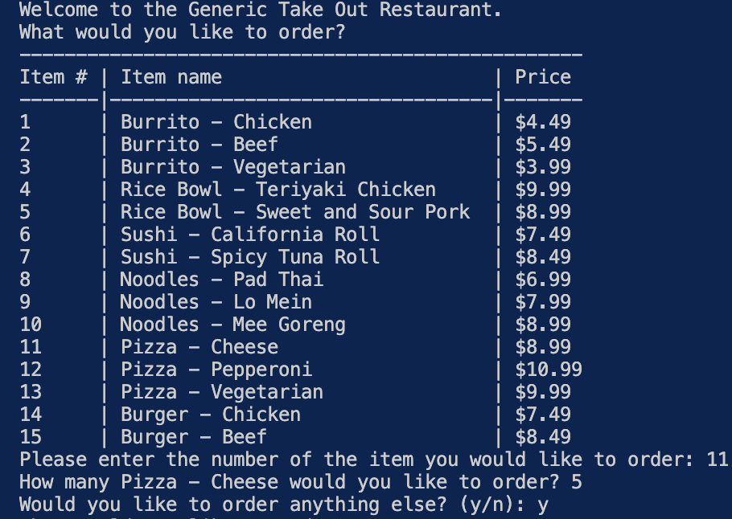

# Kikta_Takeout_Menu
This application uses Python to display and interact with a menu to build an order. 

## 📚 Description
This application uses Python's looping ability to create a user friendly food ordering system. Users will use command line prompts to select food items and their quantities. The application will calculate a total price and display the entire order upon completion.  

## 🚀 Table of Contents
  * [Usage](#📝-Usage)
  * [Features](#⭐-features)
  * [Credits](#🫱🏽‍🫲🏾-credits)
  * [License](#📃-license)
  * [Contact](#🗨️-contact)

## 📝 Usage
<strong>CI/CD Useage </strong>

Here are screenshots of the command line interaction.  

<u><strong>Order</strong></u>

<u><strong>Live Site</strong></u>

Back to [Table-of-Contents](#🚀-table-of-contents)

## ⭐ Features

  * Repository Branches
  * Main Protections
  * GitHub Actions on Pull Requests
  * Automated Cypress Testing

Back to [Table-of-Contents](#🚀-table-of-contents)

## 🫱🏽‍🫲🏾 Credits

For CI/CD purposes, GitHub Actions were used.

[GitHub Actions](https://github.com/features/actions)

For testing purposes, Cypress was used. 

[Cypress](https://docs.cypress.io/app/get-started/why-cypress)

This application was created to requiresthe use of Express.js, MongoDB database, and Mongoose ODM. 

[MongoDB Docs](https://www.mongodb.com/docs/)

Back to [Table-of-Contents](#🚀-table-of-contents)

## 📃 License
This application is unlicensed. 

Back to [Table-of-Contents](#🚀-table-of-contents)

## 🗨️ Contact

  <strong>Email:</strong> [MelissaKikta2025@u.northwestern.edu](mailto:MelissaKikta@u.northwestern.edu)
  
  <strong>GitHub:</strong> [GitHub.com/MelissaKikta](https://github.com/melissakikta)

Back to [Table-of-Contents](#🚀-table-of-contents)
